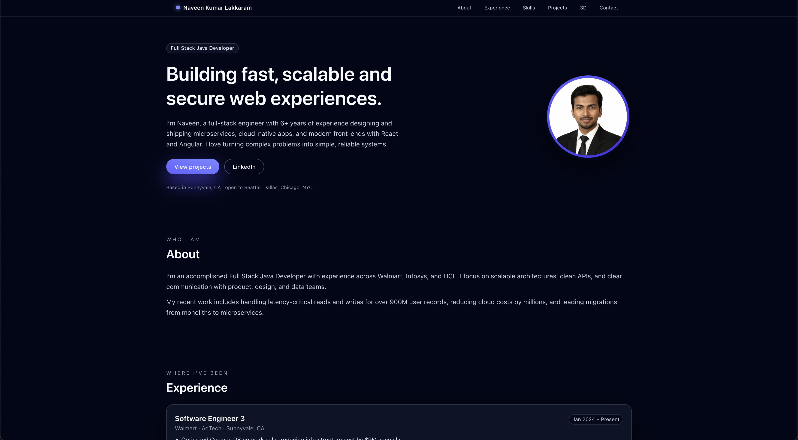

<p align="center" width="100%">
  <!-- Replace with your own banner / screenshot -->
  
</p>

<h1 align="center">Naveen – Developer Portfolio</h1>

<p align="center">
  <strong>A modern, responsive, 3D-enhanced portfolio for a Full Stack Java Developer</strong>
</p>

<p align="center">
  
  
  
  
  
  
</p>

<p align="center">
  <a href="#demo-movie_camera">Demo</a> •
  <a href="#features-sparkles">Features</a> •
  <a href="#sections-bookmark">Sections</a> •
  <a href="#tech-stack-computer">Tech Stack</a> •
  <a href="#getting-started-dart">Getting Started</a> •
  <a href="#customization-art">Customization</a> •
  <a href="#deployment-rocket">Deployment</a>
</p>

---

## Overview

This repository contains my personal developer portfolio, built with **React**, **TypeScript**, **Vite**, **Tailwind CSS**, and a lightweight **Three.js** scene using `@react-three/fiber`.

It’s designed to be:

- clean and minimalist,
- focused on **developer case-studies** rather than buzzwords,
- responsive on everything from large monitors to small mobile screens,
- and easy to maintain / extend as my experience grows.

You can use it as inspiration or as a starting point for your own portfolio.

---

## Demo :movie_camera:

<p align="center">
  <!-- Replace with a real screenshot -->
  
</p>

<p align="center">
  <!-- Replace with your actual GitHub Pages URL once deployed -->
  <a href="https://lakkaramnaveen.github.io/naveen-portfolio/" target="_blank">
    <strong>🚀 View Live Demo</strong>
  </a>
</p>

---

## Features :sparkles:

- ✅ **Modern UI** inspired by high-end product sites (Apple-style gradients & smooth cards)
- ✅ **Fully Responsive** – looks great from ~320px mobile up to ultra-wide displays
- ✅ **Developer-Focused Layout** – clear sections for experience, skills, projects & contact
- ✅ **3D Experience** – a performant Three.js cube scene built with `@react-three/fiber`
- ✅ **Tailwind-First Styling** – utility classes + a few custom tokens for consistent design
- ✅ **TypeScript Everywhere** – typed React components and props
- ✅ **No Backend Needed** – pure static site, perfect for GitHub Pages / Netlify / Vercel
- ✅ **Easy to Customize** – edit a few React components to make it your own
- ✅ **Fast Dev Experience** – Vite for super quick dev server and builds

---

## Sections :bookmark:

The site is structured around clear, focused sections:

| Section             | Description                                                                |
| ------------------- | -------------------------------------------------------------------------- |
| 🦸 **Hero**         | Intro, headline, CTAs and profile photo in a prominent hero layout         |
| 👤 **About**        | Brief summary of who I am and what I like to work on                       |
| 💼 **Experience**   | Timeline of roles (Walmart, Infosys, HCL, etc.) with impact-driven bullets |
| 🛠️ **Skills**       | Tech stack grouped by Languages, Frontend, Backend, Databases, DevOps      |
| 🚀 **Projects**     | Selected work with tags and short case-study style descriptions            |
| 🎮 **3D Portfolio** | Minimal Three.js scene rendered via `@react-three/fiber`                   |
| 📧 **Contact**      | Quick ways to reach me: email, LinkedIn, GitHub                            |
| 📜 **Footer**       | Copyright + stack mention + hosting information                            |

Each section lives in its own React component under `src/components/sections/` and is composed using a small set of shared building blocks (`Section`, `Tag`, `TimelineItem`).

---

## Tech Stack :computer:

| Technology             | Purpose                                      |
| ---------------------- | -------------------------------------------- |
| **React**              | Component-based UI                           |
| **TypeScript**         | Static typing for safer, clearer code        |
| **Vite**               | Dev server & bundler                         |
| **Tailwind CSS**       | Utility-first styling + custom design tokens |
| **@tailwindcss/vite**  | Native Tailwind 3/4 integration with Vite    |
| **Three.js**           | 3D rendering (via react-three-fiber)         |
| **@react-three/fiber** | React renderer for Three.js                  |
| **@react-three/drei**  | Useful helpers (OrbitControls, etc.)         |

---

## Project Structure :file_folder:

```text
naveen-portfolio/
├─ public/
│  ├─ profile.png
│  ├─ screenshot-home.png
│  └─ favicon.svg
├─ src/
│  ├─ components/
│  │  ├─ common/
│  │  │  ├─ Section.tsx
│  │  │  ├─ Tag.tsx
│  │  │  └─ TimelineItem.tsx
│  │  ├─ layout/
│  │  │  ├─ Navbar.tsx
│  │  │  └─ Footer.tsx
│  │  └─ sections/
│  │     ├─ Hero.tsx
│  │     ├─ About.tsx
│  │     ├─ Experience.tsx
│  │     ├─ Skills.tsx
│  │     ├─ Projects.tsx
│  │     ├─ Contact.tsx
│  │     └─ ThreeD.tsx (PortfolioScene)
│  ├─ three/
│  │  └─ PortfolioScene.tsx
│  ├─ App.tsx
│  ├─ main.tsx
│  └─ index.css
├─ tailwind.config.js
├─ postcss.config.js
├─ vite.config.ts
├─ tsconfig.json
└─ package.json
```
